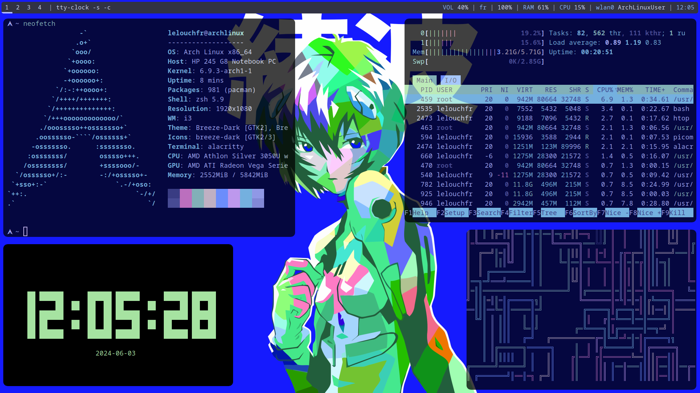
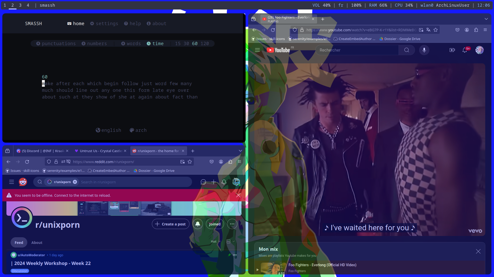
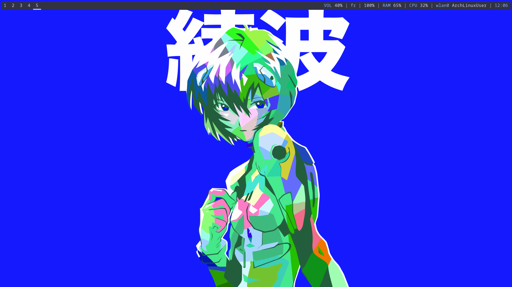

# LelouchFR's Dotfiles Config

Hello and welcome to my dotfiles, hope you're going to find all the things you need right here ;)

<details>
    <summary><h2>Preview</h2></summary>
    <figure style="display: flex; flex-direction: column; align-items: center;">
        <div style="margin-bottom: 20px; text-align: center;">
            
            <figcaption>commands: <a href="https://github.com/dylanaraps/neofetch">neofetch</a>, <a href="https://htop.dev/">htop</a>, <a href="https://github.com/xorg62/tty-clock">tty-clock</a>, <a href="https://github.com/pipeseroni/pipes.sh">pipes.sh</a></figcaption>
        </div>
        <div style="margin-bottom: 20px; text-align: center;">
            
            <figcaption>commands: <a href="https://github.com/kraanzu/smassh">smassh</a>, <a href="https://archlinux.org/packages/extra/x86_64/firefox/">firefox</a></figcaption>
        </div>
        <div style="text-align: center;">
            
            <figcaption>polybar + wallpaper</figcaption>
        </div>
    </figure>
</details>

## Installation

install i3:

```bash
sudo pacman -S i3 # select everything from i3
```

install all the other dependencies to get a smooth experience:

```bash
sudo pacman -S picom zsh neovim polybar alacritty tmux feh
```

clone the repository:

```bash
git clone https://github.com/LelouchFR/dotfiles.git ~/
```
