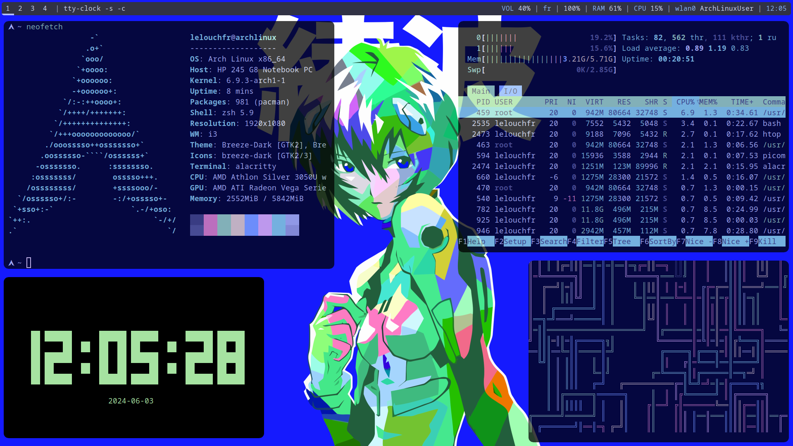
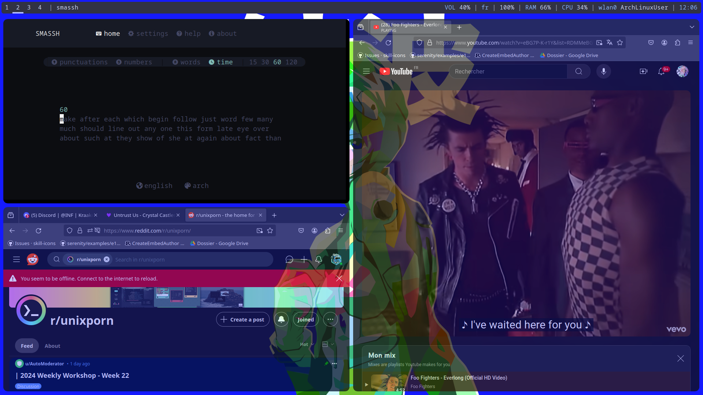
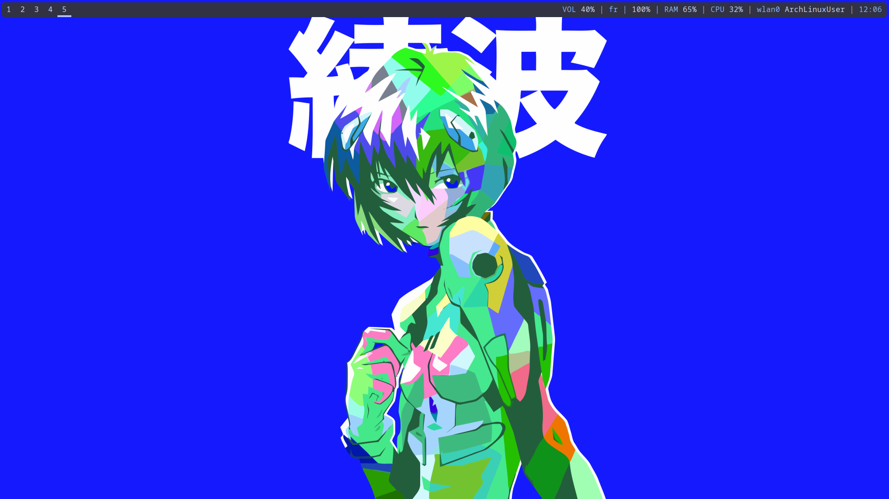
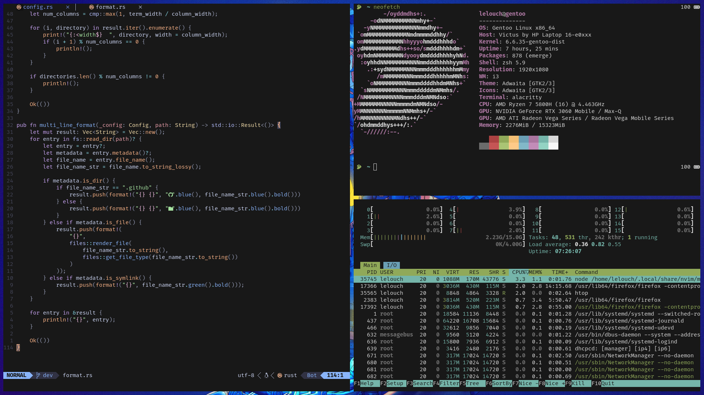
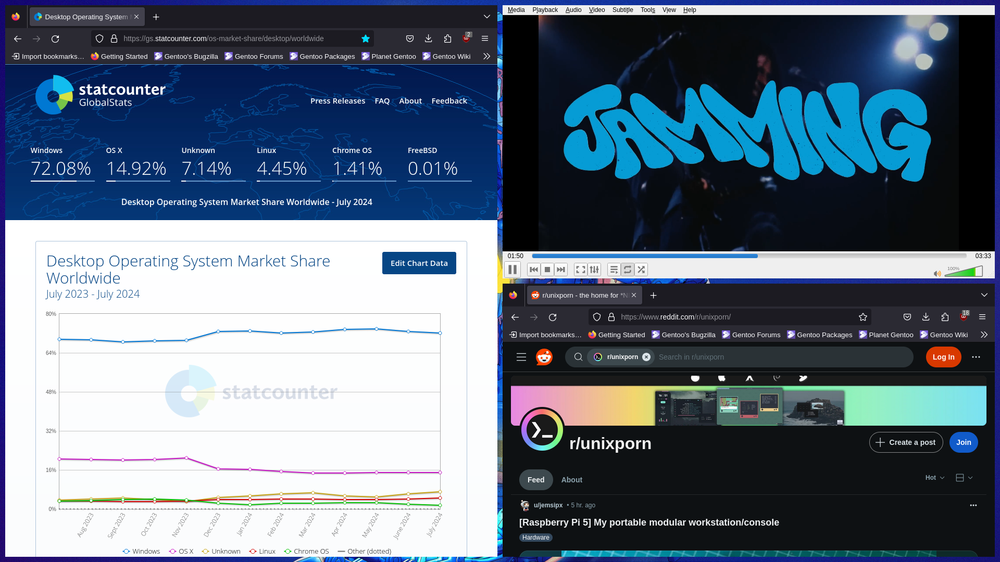
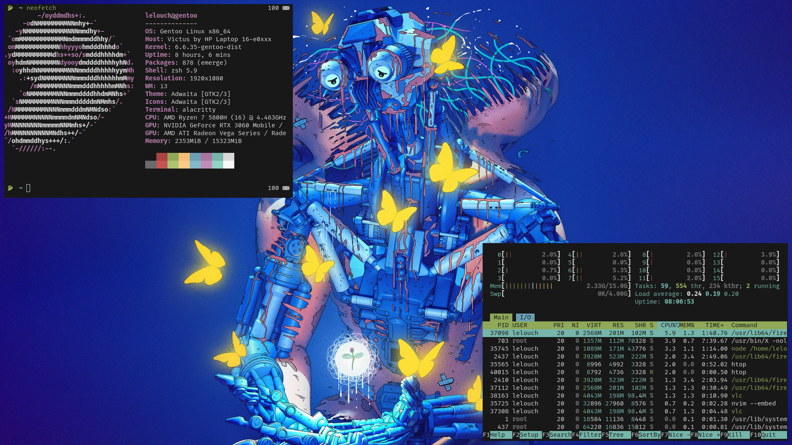

# LelouchFR's Dotfiles Config

Hello and welcome to my dotfiles, hope you're going to find all the things you need right here ;)

<details>
    <summary><h2>Arch Preview</h2></summary>
    <figure style="display: flex; flex-direction: column; align-items: center;">
        <div style="margin-bottom: 20px; text-align: center;">
            
            <figcaption>commands: <a href="https://github.com/dylanaraps/neofetch">neofetch</a>, <a href="https://htop.dev/">htop</a>, <a href="https://github.com/xorg62/tty-clock">tty-clock</a>, <a href="https://github.com/pipeseroni/pipes.sh">pipes.sh</a></figcaption>
        </div>
        <div style="margin-bottom: 20px; text-align: center;">
            
            <figcaption>commands: <a href="https://github.com/kraanzu/smassh">smassh</a>, <a href="https://archlinux.org/packages/extra/x86_64/firefox/">firefox</a></figcaption>
        </div>
        <div style="text-align: center;">
            
            <figcaption>polybar + wallpaper</figcaption>
        </div>
    </figure>
</details>

<details>
    <summary><h2>Gentoo Preview</h2></summary>
    <figure style="display: flex; flex-direction: column; align-items: center;">
        <div style="margin-bottom: 20px; text-align: center;">
            
            <figcaption>commands: <a href="https://github.com/dylanaraps/neofetch">neofetch</a>, <a href="https://htop.dev/">htop</a>, <a href="https://neovim.io/">neovim</a></figcaption>
        </div>
        <div style="margin-bottom: 20px; text-align: center;">
            
            <figcaption>commands: <a href="https://packages.gentoo.org/packages/www-client/firefox">firefox</a>, <a href="https://packages.gentoo.org/packages/media-video/vlc">vlc</a></figcaption>
        </div>
        <div style="text-align: center;">
            
            <figcaption>neofetch + htop</figcaption>
        </div>
    </figure>
</details>

## Installation

important: choose between `reusable` and `unusable`. `reusable` lets you the whole repository and all the config files  and does symlinks from there on. `unusable` deletes every single thing you don't need and moves files to their place instead of doing symlinks.

for arch dotfiles:

```bash
./install arch unusable
```

for gentoo dotfiles:

```bash
./install gentoo unusable
```
